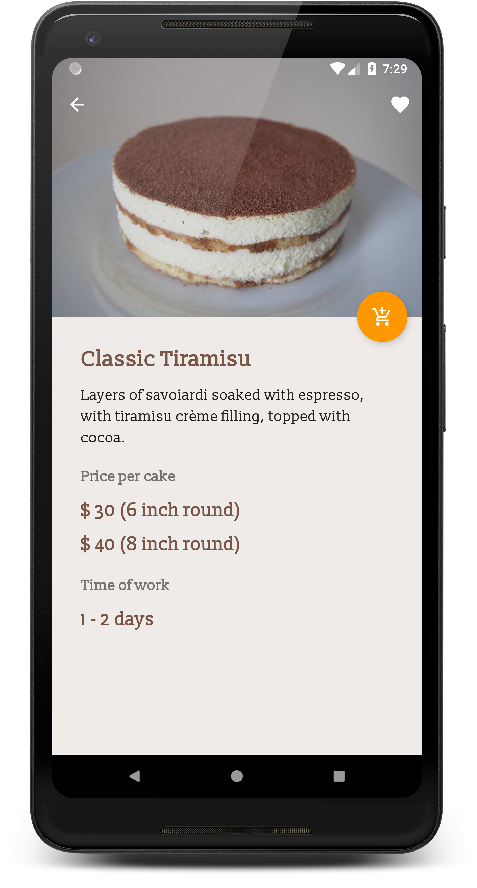

# Pencake

**Platform: Android (Min SDK: 19, Target SDK: 27)**

**Author: [Timotius Oktorio](https://ca.linkedin.com/in/timotiusoktorio "LinkedIn Profile") (toktorio@gmail.com)**

This is a cake ordering app for a fictional bakery business called Pencake. Pencake is a local bakery shop in Mississauga that sells a variety of butter-cream cakes, cupcakes, cookies, and pastries.

Users can use this app to browse all available cakes, make orders, and find information about the business. Since this is just a fictional bakery business, orders will not be actually processed and no payments will be accepted. 

*This app is created as the capstone project of [Android Developer Nanodegree](https://www.udacity.com/course/android-developer-nanodegree-by-google--nd801) program at Udacity.*

### Features
- Browse all available cakes and products offered by the bakery.
- Make orders, check order statuses, and see past orders.
- Save products that you like as a favorite for faster search.
- Find information about the bakery such as the location and contact details.
- Synchronize your data with all of your devices by creating an account.

### What I have learned from this project
- Planning and designing an app by creating a [project proposal](https://docs.google.com/document/d/1TD7zecP-zy1By4kKYzhgaODuWo82AX75aho6cWg37x8/edit?usp=sharing) and wireframes.
- Using [Android Architecture Components](https://developer.android.com/topic/libraries/architecture/) libraries and [MVVM](https://en.wikipedia.org/wiki/Model%E2%80%93view%E2%80%93viewmodel) software architectural pattern.
- Using [Android Data Binding](https://developer.android.com/topic/libraries/data-binding/) library to bind UI components in layout files to data sources in the app.
- Using [Firebase Realtime Database](https://firebase.google.com/docs/database/) to store data locally and remotely.
- Using [Firebase Authentication](https://firebase.google.com/docs/auth/) to authenticate user to the app.
- Using [Google Maps SDK for Android](https://developers.google.com/maps/documentation/android-sdk/intro) to display a map in the app.

  

Get the apk file [here](https://github.com/toktorio/Cake-Ordering-App/blob/master/app/release/cake-ordering-app.apk?raw=true) to install the app on your device. Note that depending on your device settings, you might need to allow installation from unknown sources in order to install this app. Visit this [link](https://www.androidcentral.com/unknown-sources) for the detailed instructions.